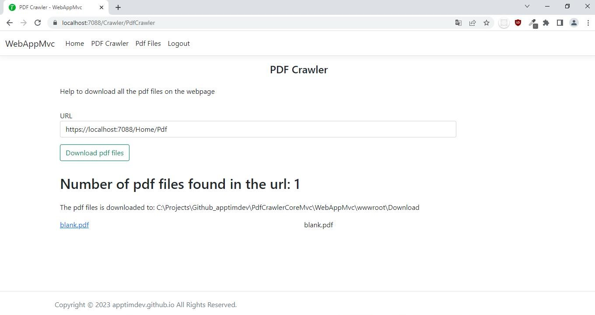

## Pdf Crawler, C# Asp dot net core mvc
This webpage is created using ASP.NET Core.

This is a small project that is used to help download the free pdf files on the websites that do not require any authentication.

No database is used. The pdf files are saved to the server.

---

Current status of webpage:




---

## Installation
The tools installed on my computer:
Visual Studio 2022
Microsoft SQL Server Express

.NET 6.0 SDK
ASP.NET Core 6.0 Runtime (v6.0.12) - Windows Hosting Bundle
Download Link
https://dotnet.microsoft.com/en-us/download/dotnet/6.0

---

## log4net
Install log4net
1. Go to Tools > NuGet Package Manager > Package Manager Console,
```cmd
Install-Package Microsoft.Extensions.Logging.Log4Net.AspNetCore
```

---

## packages
- Microsoft.EntityFrameworkCore
- Microsoft.EntityFrameworkCore.SqlServer
- Microsoft.EntityFrameworkCore.Tools
- Microsoft.Extensions.Logging.Log4Net.AspNetCore
- HtmlAgilityPack

---

## Migrations
```cmd
Add-Migration v1
Update-Database
```

```cmd
dotnet run seeddata
```

---
